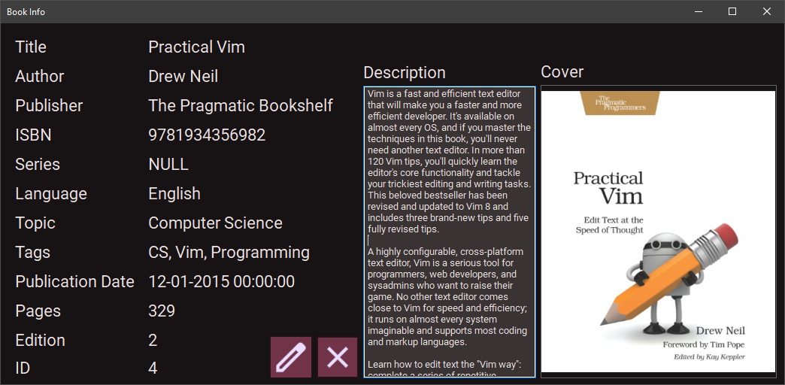

# My Book Library

More screenshots in `Pics` folder.

A .NET Framework desktop application, used to track and manage user's own books.
Applied my own theme engine library to change forms colors.

---
## How to use
1. Clone this repo.
2. Run Visual Studio 2022.
3. Build the project.
4. Copy `MyBookLibrary` folder under `_FILES` folder to `C:\` drive.
5. Restore `MyBookLibrary.bak` database under `_FILES` folder in MSSQL server.
4. Run the form.
5. Use `Admin` as the user name, and `1234` as the password.

---
## Technologies
1. .NET Framework.
2. Windows forms.
3. C\#.
4. ADO.NET.
5. Microsoft SQL Server with T-SQL.

---
